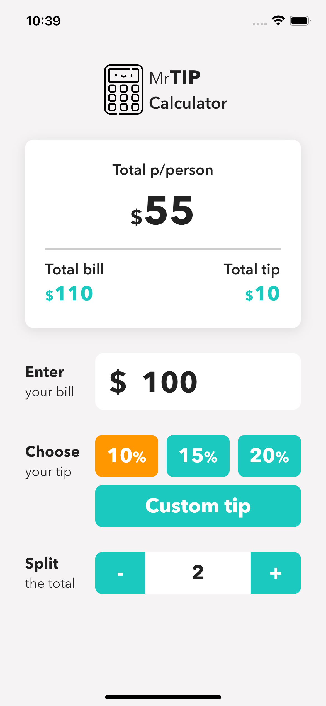
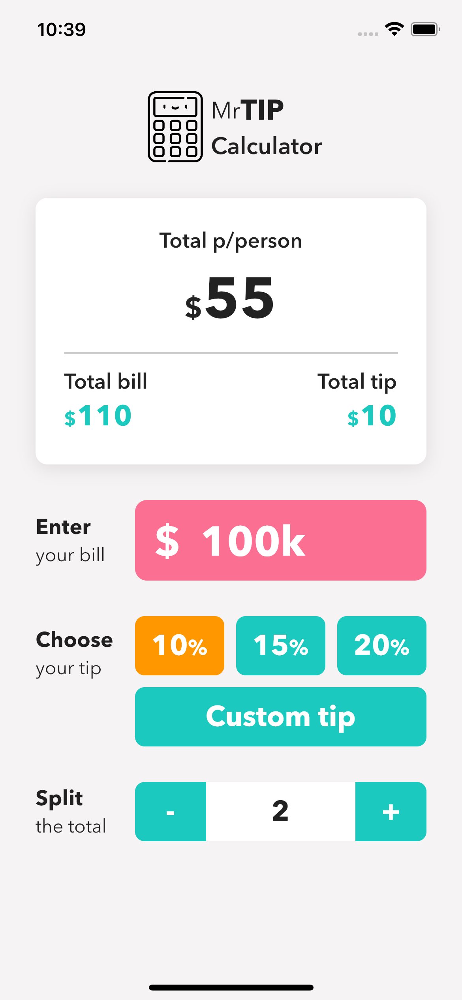
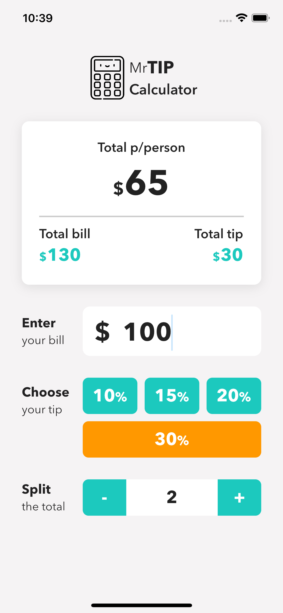
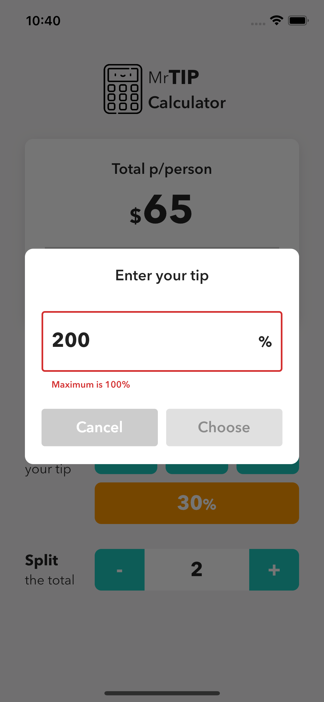

# Tip Calculator

## Description:
Tip Calculator is a simple mobile application that helps users calculate the tip amount based on the total bill and desired tip percentage. This app allows users to easily and quickly calculate the tip amount they need to pay in various situations such as dining out, restaurants, delivery services, or any field that requires tipping.

## Key Features:

1. Tip Calculation: Users input the total bill amount and select the desired tip percentage (either default values or custom values). The app automatically calculates the tip amount and the total amount to be paid (including both the tip and the bill total).

2. Tip Percentage Configuration: Users can customize the tip percentage according to their personal preferences or based on regulations specific to each country or region. The app provides popular tip percentage options for quick selection but also allows users to enter custom values.

3. Share Results: Users can share the calculation results (including the tip amount and the total amount to be paid) through social media sharing or messaging apps to inform friends or colleagues about the tip amount and the bill total.

4. User-Friendly and Easy-to-Use Interface: The Tip Calculator app has a simple, intuitive, and user-friendly interface. Users only need to input the necessary information and receive immediate calculation results.

5. Multi-Language Support: The app supports multiple languages to serve users in different countries and regions.

## Summary:
The Tip Calculator app is a handy tool for calculating the tip amount in a convenient and efficient way. With its user-friendly interface and customizable features, it simplifies the process of tipping and ensures accurate calculations for users in various tipping scenarios.

## Screenshot

  
  
  
  
  

